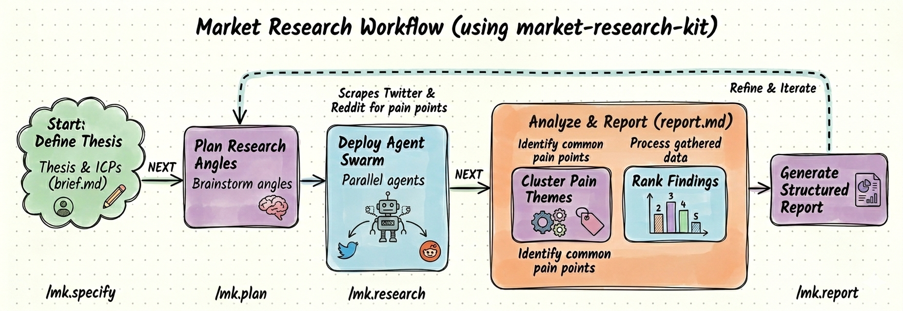

<div align="center">
    
    <h1>market-research-kit</h1>
    <h3>An agent harness that helps you nail your ICP and find them wherever they are.</h3>
    <p>Deploy agents to scrape Twitter and Reddit for real customer pain.<br/>Four commands. Ranked findings. No manual research.</p>
</div>

<p align="center">
    <a href="https://github.com/matanrak/market-research-kit/actions/workflows/test.yml"></a>
    <a href="https://github.com/matanrak/market-research-kit/blob/main/LICENSE"></a>
</p>

---



## Get Started

```bash
# Install
uv tool install marketkit-cli --from git+https://github.com/matanrak/market-research-kit.git

# Initialize in your project (defaults to Claude Code)
marketkit init

# Or pick your agent
marketkit init --ai gemini
marketkit init --ai cursor
```

This creates `.market-research/` (config, templates, plans) and installs the four `/mk.*` slash commands into your agent's commands directory. Open your agent and go.

## Research Workflow

### Step 1: Define your thesis

```
/mk.specify look through the repo, understand it, then start analyzing our ICP
```

The agent walks you through a structured interview to define your ICPs, hypothesis, and research questions. Output: `brief.md`

### Step 2: Plan research angles

```
/mk.plan
```

Two agents brainstorm angles independently (demand-side vs supply-side lens), then the best ideas are merged. You pick which angles and sources to use. Output: `plan.md`

### Step 3: Deploy the swarm

```
/mk.research
```

One agent per angle fans out across Twitter and Reddit in parallel. Each crafts its own queries using your ICP's language patterns, adapts if signal is low, and saves structured results. Output: `data/*.json`

### Step 4: Analyze findings

```
/mk.report
```

The agent classifies posts by ICP, clusters pain themes, ranks by frequency, and produces a report with real evidence linked to source posts. Output: `report.md`

## Supported Agents

| Agent | `--ai` flag | Status |
|-------|-------------|--------|
| [Claude Code](https://www.anthropic.com/claude-code) | `claude` (default) | ✅ |
| [Gemini CLI](https://github.com/google-gemini/gemini-cli) | `gemini` | ✅ |
| [Cursor](https://cursor.sh/) | `cursor` | ✅ |
| [GitHub Copilot](https://code.visualstudio.com/) | `copilot` | ✅ |
| [Codex CLI](https://github.com/openai/codex) | `codex` | ✅ |
| [Windsurf](https://windsurf.com/) | `windsurf` | ✅ |
| [opencode](https://opencode.ai/) | `opencode` | ✅ |

Any agent that reads markdown slash commands from a project directory should work. If yours isn't listed, [open an issue](https://github.com/matanrak/market-research-kit/issues).

## Data Sources

| Source | Method | Cost |
|--------|--------|------|
| `twitter` | Playwright with logged-in Chrome session | Free |
| `twitter-api` | X API v2 via `marketkit search-x-paid-api` | ~$0.005/tweet |
| `reddit-scrape` | Reddit `.json` endpoints via `curl` | Free |

## Prerequisites

- **macOS / Linux**
- [Python 3.11+](https://www.python.org/downloads/)
- [uv](https://docs.astral.sh/uv/) for package management
- A [supported AI coding agent](#supported-agents)

<details>
<summary>CLI Reference</summary>

### User Commands

| Command | Description |
|---------|-------------|
| `marketkit init` | Initialize project (defaults to `--ai claude`) |
| `marketkit init --ai <agent>` | Initialize for a specific agent (`gemini`, `cursor`, `copilot`, etc.) |
| `marketkit init --force` | Re-copy templates (preserves config) |
| `marketkit status` | Show current research project status |
| `marketkit gather` | Merge and deduplicate all collected posts, sorted by score (JSON to stdout) |
| `marketkit gather --plan <name>` | Merge posts from a specific plan |
| `marketkit gather --top N` | Return only the top N highest-scoring posts |

### Agent Commands

| Command | Description |
|---------|-------------|
| `marketkit context` | Project paths and state for agent consumption |
| `marketkit new-plan <slug>` | Create timestamped plan directory, return paths |
| `marketkit search-x-paid-api <query>` | Search X/Twitter via paid API v2 |

</details>

<details>
<summary>Project Structure</summary>

```
pyproject.toml              # Package configuration (marketkit-cli)
src/marketkit/
├── cli.py                  # CLI commands (Typer)
├── config.py               # Project discovery and template installation
├── constants.py            # App name, paths, command template enum
├── ui.py                   # Rich formatting (banner, step tracker)
├── writer.py               # JSON collection writer/reader/merger
└── collectors/
    ├── base.py             # Post dataclass + Collector ABC
    └── x_api.py            # X API v2 collector (bearer token auth)
templates/
├── commands/               # Slash command templates (/mk.*)
├── brief-template.md       # Research brief template
└── plan-template.md        # Research plan template
tests/                      # Test suite
```

</details>

<details>
<summary>Development</summary>

```bash
git clone https://github.com/matanrak/market-research-kit.git
cd market-research-kit
uv venv && uv pip install -e ".[test]"
uv run python -m pytest -v
```

</details>

## License

[MIT](LICENSE)
